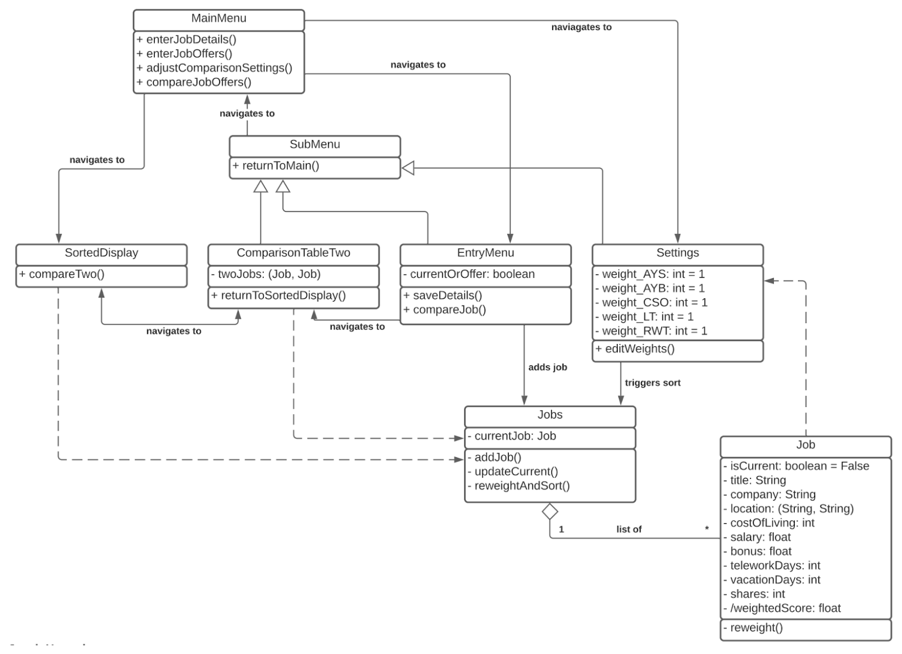
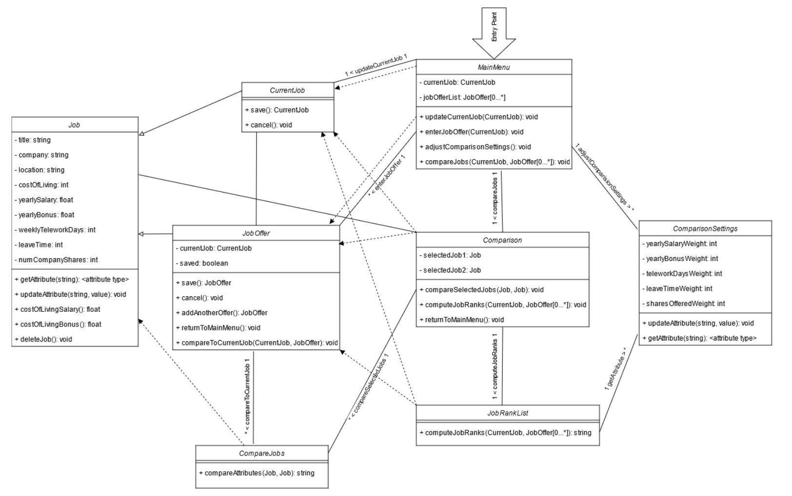
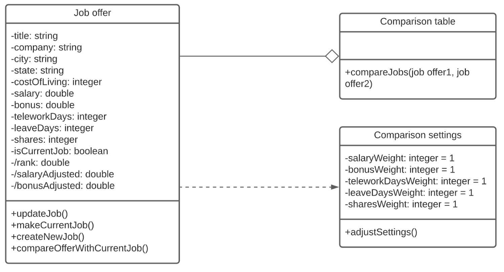
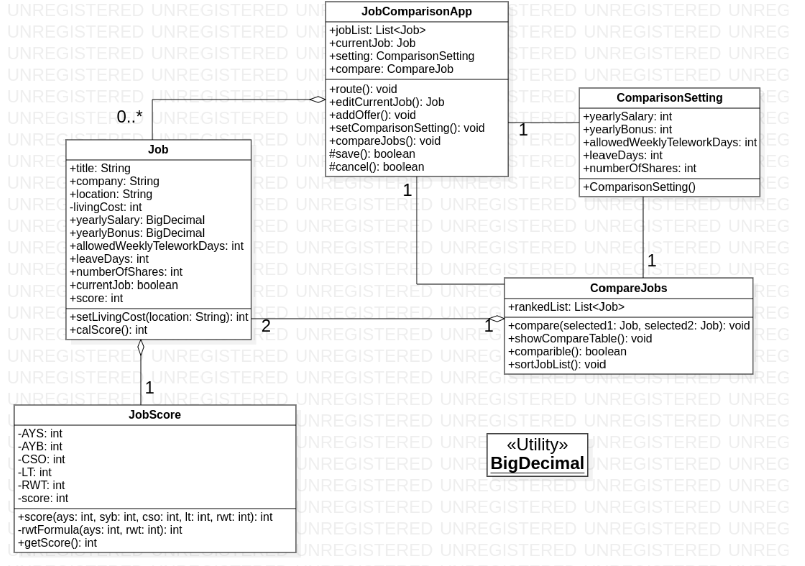
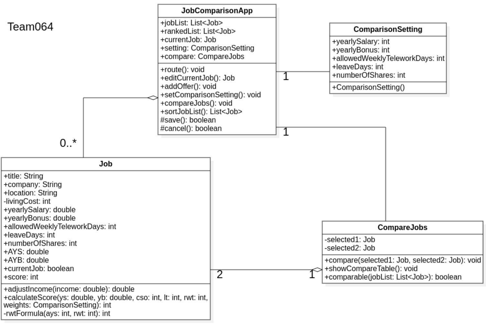

# Individual Designs

## Design 1

Pros:
*   Meets functional requirements and has a clear entry point.
*   Insertion sorts jobs as they are added so that the sorted comparison table is quick to load.
*   Has a reference to the current job that’s quicker and easier to use than searching through a list.

Cons:
*   Contains UI centric classes that should be removed
*   Overall app state could instead be tracked in a single “app” class.

## Design 2

Pros: 
*   Explicit classes for user actions

Cons: 
*   Covers too much UI work
*   MainMenu navigation can be handled by the UI

## Design 3

Pros:
*   Minimal needed for functional requirements, cuts down on extraneous classes and functions
*   Stores the current job alongside the other jobs
*   Not bogged down with any UI logic

Cons:
*   Doesn’t include an entry point or central class to store the job list/user preferences and delegate tasks to the appropriate classes.
*   Abstracts away all the job score related logic
*   ComparisonTable class doesn’t store any state or really have much to do besides show a table, arguable a UI function
*   Could be difficult to find the current job; would be good to store a reference to it in the central class

## Design 4

Pros:
*   Covered most functional requirements.

Cons:
*   For efficiency, sorting the job list should be done more explicitly than comparing. Do it after each new job offer is added.
*   To calculate the job score, the class lacks a function to grab the weighted value.

# Team Design

We built off of Jiahui’s design. We decided that `Job Score` didn’t need to be broken out as its own class, so we combined it with the `Job` class. We cleaned up some of the functions, such as removing setters and moving `sortJobList()` to belong to the App class, where it made more sense. We felt the `JobComparisonApp`, `ComparisonSetting`, `Job`, and `CompareJobs` classes were precisely what we needed to cover all of the requirements.

We also incorporated the `rankedList` from a different design, as we believe that will simplify the comparison table functionality. We included a few UI methods to ensure we covered all the functional requirements, but did not include as many UI pieces as some of the individual designs. Jiahui’s design was a great starting point for the group, as it was a well laid out, concise middle ground between all of our designs.

# Summary

In the process of discussing the designs, we found a discussion during a team meeting and following up via asynchronous communication to be effective. After seeing each other’s designs, we had more insight into how our teammates approached problems, as well as flaws in our own designs. This allowed us to synthesize the best portions of our own design into the team design.

We had some debate about which UI methods to include, and chose to err on the side of over-communicating to ensure we met all of the requirements set forth in the assignment. We worked to ensure we cut extraneous information while keeping the core functionality in place. We learned to see each other’s viewpoints and consider the problem from different angles, which allowed us to arrive at a design that captured all our perspectives.