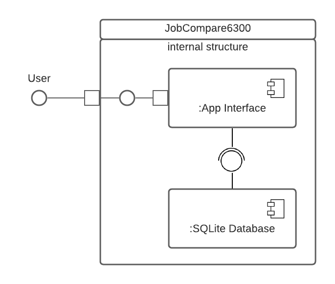
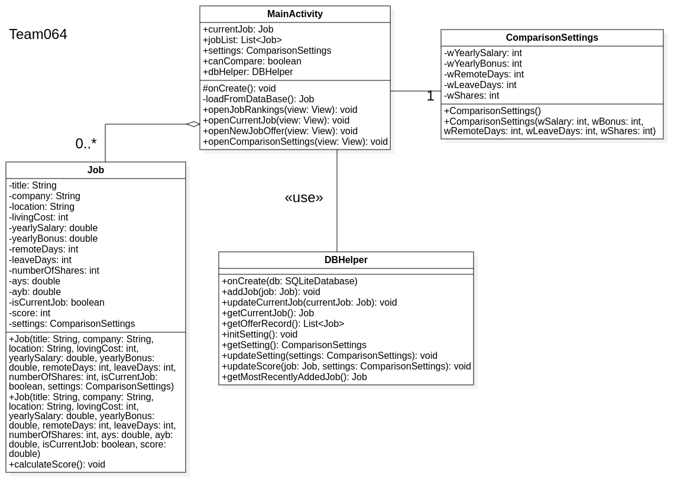
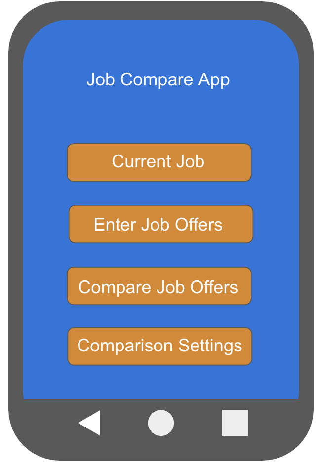
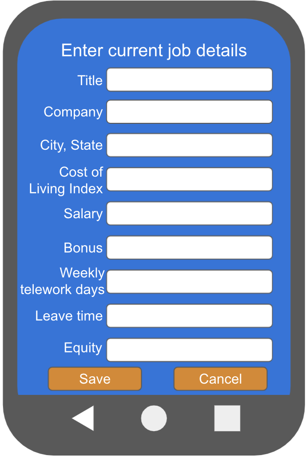
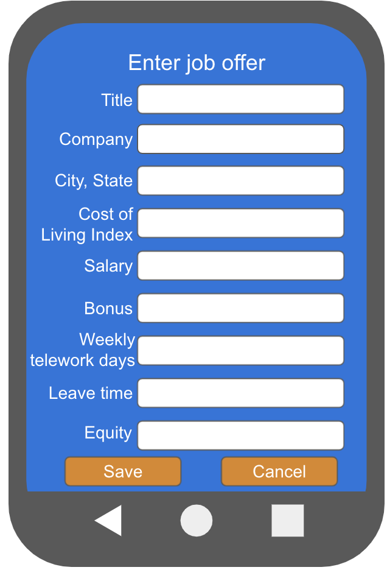
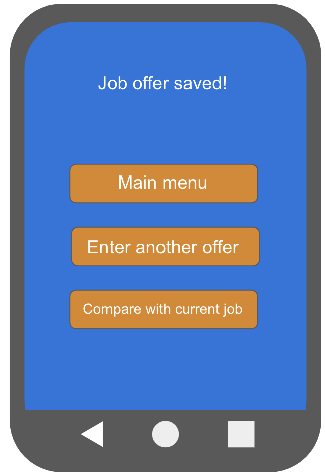
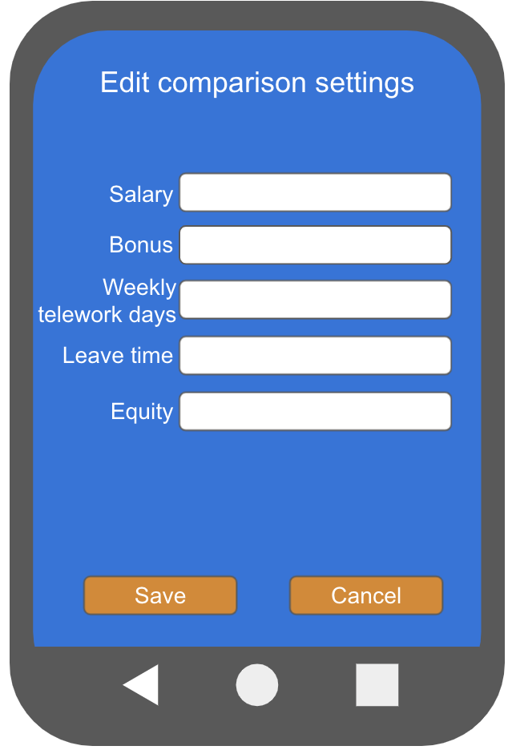
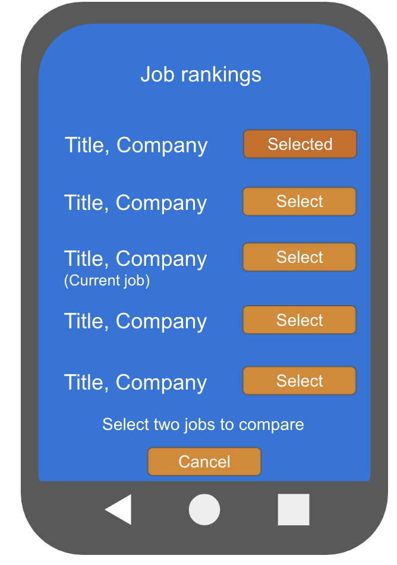
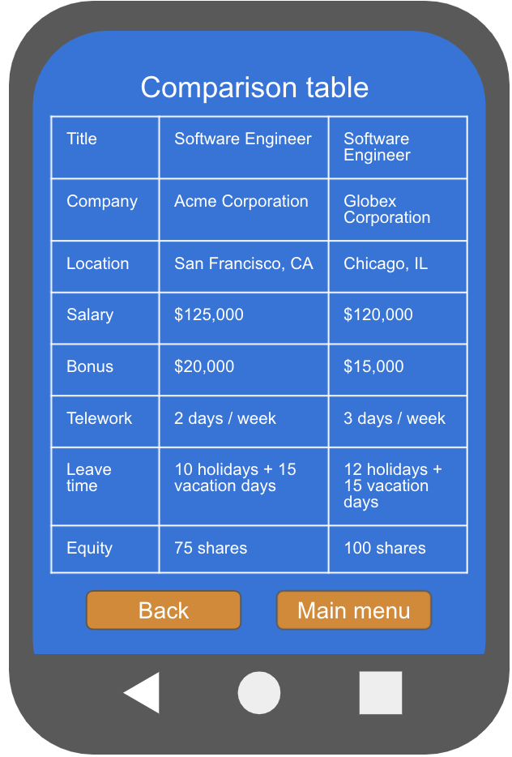

# Design Document

**Author**: Team 064  
**Version**: 3.0 (Class diagram updated; Removed note regarding deplying to physical device)

## 1 Design Considerations
### 1.1 Assumptions

*   The application will be entirely self contained and used by a single user. 
*   The user may enter data, close the application and resume work at a later time. 
*   When a user is shown a list of job offers (including the current job), the list will be automatically shown in ranked order. In other words, no user input is needed to order the sort the job offers by rank. 
*   Users will update their current job on one screen in the app. This means a job offer cannot be converted to the current job. 
*   The user will provide the cost of living index for adjusting salary and bonus information.

### 1.2 Constraints

*   The application will not utilize a remote database. It will instead save all data locally via SQLite.

### 1.3 System Environment

*   The application will be built on Android 9.0 (Pie) and run on compatible mobile devices.
*   Testing will be completed with a virtual Pixel 4a device.
*   Code will be developed using Java 11 and Android Studio.
*   It will not interact with any external software.

## 2 Architectural Design

### 2.1 Component Diagram

The User interacts with the main application interface, which interacts with the SQLite database.

### 2.2 Deployment Diagram

This application is entirely self contained, running on a single mobile Android device. We will test with an emulated Android device Pixel 4a. This can be achieved easily via Android Studio, thus a deployment diagram is unnecessary. 

## 3 Low-Level Design
### 3.1 Class Diagram

### 3.2 Other Diagrams

Database table description for `Job`:

|field name|type|required|primary key|foreign key|
|--- |--- |--- |--- |--- |
|title|varchar|TRUE|TRUE|FALSE|
|company|varchar|TRUE|TRUE|FALSE|
|location|varchar|TRUE|TRUE|FALSE|
|living_cost|int|FALSE|FALSE|FALSE|
|yearly_salary|double|FALSE|FALSE|FALSE|
|yearly_bonus|double|FALSE|FALSE|FALSE|
|allowed_weekly_telework|int|TRUE|FALSE|FALSE|
|leave_days|int|TRUE|FALSE|FALSE|
|number_of_shares|int|TRUE|FALSE|FALSE|
|ays|double|TRUE|FALSE|FALSE|
|ayb|double|TRUE|FALSE|FALSE|
|current_job|boolean|FALSE|FALSE|FALSE|
|score|double|TRUE|FALSE|FALSE|

Database table description for `comparison settings`:

|field name|type|required|primary key|foreign key|
|--- |--- |--- |--- |--- |
|settng_index|int|TRUE|TRUE|FALSE|
|yearly_salary|int|TRUE|FALSE|FALSE|
|yearly_bonus|int|TRUE|FALSE|FALSE|
|allowed_weekly_telework|int|TRUE|FALSE|FALSE|
|leave_days|int|TRUE|FALSE|FALSE|
|number_of_shares|int|TRUE|FALSE|FALSE|

## 4 User Interface Design

