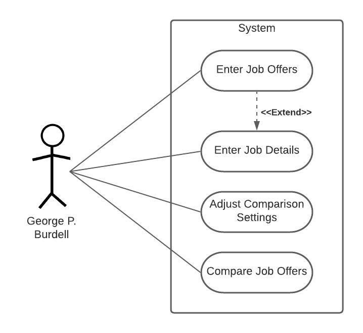

# Use Case Model

**Author**: Team 064  
**Version**: 2.0 (Button names updated to match names included in final app release)

## 1 Use Case Diagram

## 2 Use Case Descriptions

**Enter Job Offers**
- Requirements: Allow the user to enter or edit current job details

- Pre-conditions: None

- Post-conditions: Current job details are defined (only if saved)

- Scenarios:
	- User selects "Current Job" -> System brings up information fields -> User enters information into fields -> User selects "Save" -> System saves field information -> System returns to main menu
	- User selects "Current Job" -> System brings up information fields -> User enters information into fields -> User selects "Cancel" -> System returns to main menu

**Enter Job Details**
- Requirements: Allow the user to enter details of a new job offer

- Pre-conditions: None

- Post-conditions: New job added to Job list (only if saved)

- Scenarios:
	- User selects "Enter job offer" -> System brings up information fields -> User enters information into fields -> User selects "Save" -> System saves field information -> System returns to main menu
	- User selects "Enter job offer" -> System brings up information fields -> User enters information into fields -> User selects "Cancel" -> System returns to main menu

**Adjust Comparison Settings**
- Requirements: Allows user to change comparison setting parameters

- Pre-conditions: None

- Post-conditions: Setting weights have been changed (only if saved)

- Scenarios:
	- User selects "Comparison Settings" -> System brings up information fields -> User enters information into fields -> User selects "Save" -> System saves field information -> System returns to main menu
	- User selects "Comparison Settings" -> System brings up information fields -> User enters information into fields -> User selects "Cancel" -> System returns to main menu
 
**Compare Job Offers**
- Requirements: Allows to user to view a list of the entered jobs sorted by weighted score. After being presented the list of offers, the user is prompted to select two jobs to compare their respective details head-to-head.

- Pre-conditions: At least two job offers have been entered OR the current job and one job offer have been entered

- Post-conditions: None

- Scenarios:
	- User selects "Compare Job Offers" -> System displays sorted job offer list, including current job (indicated by a white box if present) -> User selects two jobs from list via the "Select" buttons -> System displays head-to-head comparison of the selected offers -> User selects "Cancel" -> System returns to main menu
	- User selects "Compare Job Offers" -> System displays sorted job offer list, including current job (indicated by a white box if present) -> User selects two jobs from list via the "Select" buttons -> System displays head-to-head comparison of the selected offers -> User selects "Back" -> System returns to sorted job offer list display
